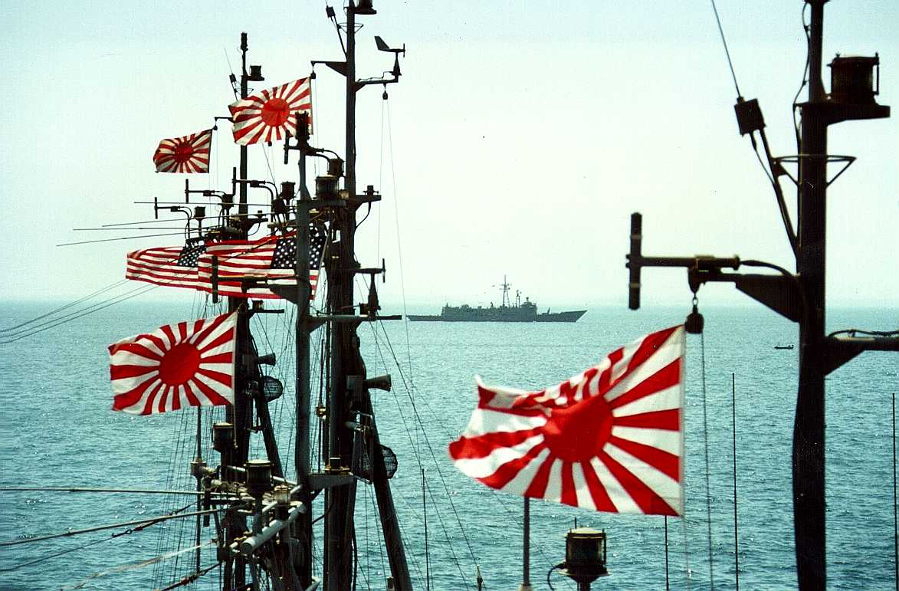

[omf]: https://en.wikipedia.org/wiki/Japan_Maritime_Self-Defense_Force#Post_Cold_War

# Mine Counter Measures Group, mid-1991

 <em>Click to see full-size</em>
 Copyright &copy; 1999 Paul M. Aoki.  All rights reserved.

This picture was taken from _MERRILL_'s O3 level during the Coalition
Mine Counter Measures Group &ldquo;raft-up&rdquo; (pictured and
described [elsewhere](raft-caption.html) at this site).  The American
and Japanese ensigns are flying from the masts of minesweepers from
the Japanese Maritime Self-Defense Force (JMSDF).  The frigate in the
background is, I believe, USS
[_KAUFFMAN_](https://en.wikipedia.org/wiki/USS_Kauffman_(FFG-59)) (FFG
59).

This is one of my favorite photos because of the dramatic
juxtaposition of the Japanese naval ensigns with the American flags
and warship.  The JMSDF [Overseas Mine Force][omf] was the first
foreign deployment of armed Japanese military units since the Second
World War; it was quite thought-provoking to find myself (a
Japanese-American _sansei_ whose parents and grandparents were
interned from 1942-1945) serving in the U. S. Navy and operating with
the JMSDF during the 50th anniversary year of Pearl Harbor!

[[back]](navy.html)
