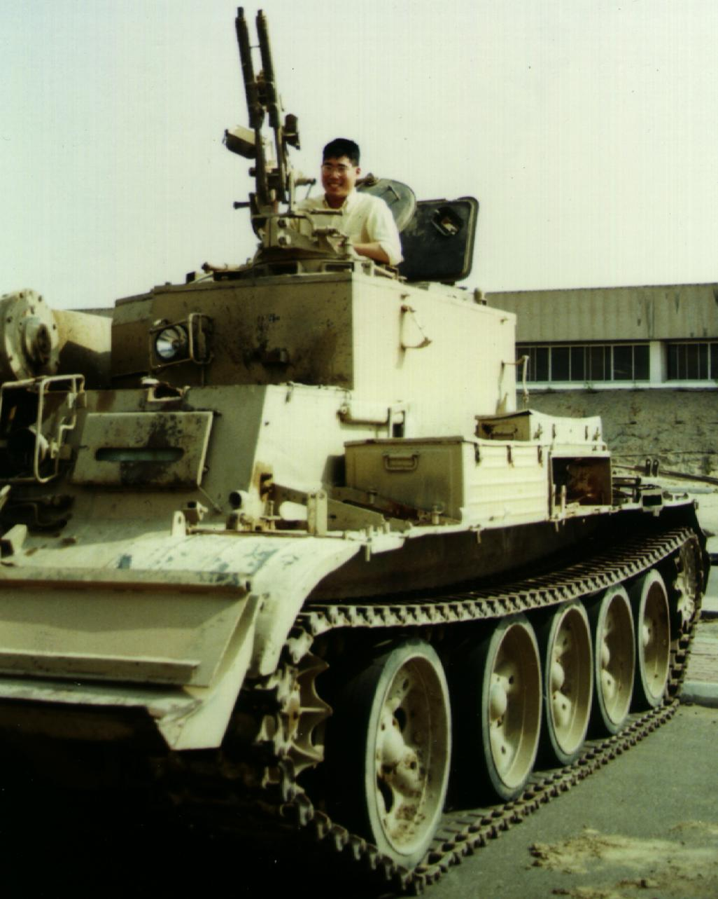

# Kuwait City, mid-1991

 <em>Click to see full-size</em>

In 1991, _MERRILL_ arrived in the Arabian Gulf after the DESERT STORM
ceasefire, but in time to be the second US warship to tie up in the
Kuwait City harbor since the Iraqi invasion (the somewhat dubious
honor of being first went the USNAVCENT command ship, USS
[_LA SALLE_](https://en.wikipedia.org/wiki/USS_La_Salle_(AGF-3)) (AGF
3)).  The crew had the sobering and somewhat surreal experience of
visiting the &ldquo;Highway of Death&rdquo; before it had been
completely cleared (accompanied, of course, by British Army sappers to
prevent unfortunate accidents).

[[back]](navy.html)
