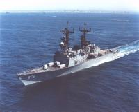

[opcr]: https://web.archive.org/web/20180712120653/http://www.globalsecurity.org/military/ops/classic_resolve.htm
[opfv]: https://web.archive.org/web/20170903054320/https://www.globalsecurity.org/military/ops/fiery_vigil.htm
[opew]: https://web.archive.org/web/20190623134713/https://www.history.navy.mil/browse-by-topic/heritage/banners/battle-streamers/armed-forces-expeditionary-service.html
[opds]: https://web.archive.org/web/20190623134655/https://www.history.navy.mil/browse-by-topic/heritage/banners/battle-streamers/southwest-asia-service.html
[ndsm]: https://web.archive.org/web/20190531131658/https://www.history.navy.mil/browse-by-topic/heritage/awards/service-campaign/national-defense-service-medal.html
[burke]: https://web.archive.org/web/20190711182534/https://www.secnav.navy.mil/doni/Directives/01000%20Military%20Personnel%20Support/01-500%20Military%20Training%20and%20Education%20Services/1520.18J.pdf
[outboard]: https://web.archive.org/web/20190711181729/https://www.forecastinternational.com/archive/disp_old_pdf.cfm?ARC_ID=738
[register]: https://web.archive.org/web/20040221182933/http://www.nvr.navy.mil:80/nvrships/details/DD976.htm
[ntsb]: https://web.archive.org/web/20170629104443/https://www.ntsb.gov/investigations/AccidentReports/Reports/MAR9202.pdf
[mcmmap]: https://web.archive.org/web/20170520164245/http://www.pbs.org/wgbh/pages/frontline/gulf/maps/4.html
[minasalman]: https://web.archive.org/web/20011030074248/https://www.globalsecurity.org/military/facility/mina-salman.htm
[jubail]: https://web.archive.org/web/20020213173238/http://www.globalsecurity.org/military/facility/jubail.htm
[jebelali]: https://web.archive.org/web/20011030054102/https://www.globalsecurity.org/military/facility/jebel-ali.htm

# Paul's (brief) Navy career

## Where...

I received my commission at the [Naval
ROTC](http://www.nrotc.berkeley.edu/) unit at U.C.  Berkeley in 1989.
Before commissioning, I served on summer training cruises on USS
[_SCULPIN_](https://en.wikipedia.org/wiki/USS_Sculpin_(SSN-590)) (SSN
590) and USS [_BELLEAU
WOOD_](https://en.wikipedia.org/wiki/USS_Belleau_Wood_(LHA-3)),
completed a one-year &ldquo;leave of absence for graduate study&rdquo;
program (earning my MSCS at Berkeley in 1988-1989), and was selected
for the [Burke program][burke] for later graduate study.

After commissioning, I spent a few months at the Division Officer
Afloat course in Coronado, CA.  I was then detailed to USS
[_MERRILL_](https://en.wikipedia.org/wiki/USS_Merrill_(DD-976)) (DD
976), a Spruance-class destroyer based at the Naval Station in San
Diego, CA.  During my tour, _MERRILL_ deployed twice to the Arabian
Gulf and once to Latin America.  I also completed my qualification as
a surface warfare officer.

In 1991, _MERRILL_ arrived in the Arabian Gulf after the DESERT STORM
ceasefire, but in time to serve as the Coalition [minesweeping forces
flagship](raft-caption.html).

In post-Cold War 1992, I took advantage of a (voluntary!) force
reduction program, leaving active duty as a lieutenant j.g. after just
over three years of service.  I then completed my service obligation
in the Reserves.

 
Sideview of the Spruance &ldquo;Armored Box Launcher&rdquo; (ABL) ship plan.

_MERRILL_ was an odd beast.  As the test ship for the Navy's
[Tomahawk](https://en.wikipedia.org/wiki/Tomahawk_(missile)) cruise
missile program, she had not participated in the Pacific Fleet
deployment rotation and had actually never received ROH
(**r**egular **o**ver**h**aul, a process most warships go
through every 3-4 years in order to receive equipment updates and
major repairs).  Her Tomahawk armored box launchers, combined with her
[CLASSIC OUTBOARD][outboard] sensor suite, made her useful for the
Navy's main missions in the Gulf.  On the other hand, her aging
tactical weapons/sensor suite made her a bit problematic for her
nominal mission areas (i.e., sinking enemy submarines and surface
ships).  More importantly for her crew, her somewhat nominal
anti-aircraft capabilities made duty in the North Arabian Gulf fairly
trying.

_MERRILL_ was decommissioned in 1998, along with the other ABL-plan
Spruances.  (The Navy apparently decided that it would be better to
scrap them than to pay for installation of the modern Vertical
Launching System, as the ABL-plan Spruances decommissioned well ahead
of their peers.  And as of late 2005, the VLS-plan Spruances were gone
anyway.)  _MERRILL_ was [sunk as a target][register] in August 2003,
[near Hawaii](https://goo.gl/maps/iC4yptwg53wNUV7XA).

## What...

### Surface Warfare Officers School (1989)

### Anti-Submarine Warfare Officer (1989-1990)

 
Special Sea &amp; Anchor Detail on a hazy day, San Diego, 1989. 
The background appears to be NAS North Island. 
CIWS has been installed and the EARNEST WILL color scheme 
has been retained: white-topped launchers, black masts and high-hats.

 
<em>MERRILL</em> underway off of Southern California, 1989. 

#### Arabian Gulf deployment in support of Joint Task Force, Middle East (1989-1990)

It turned out _MERRILL_ was going to deploy right after my graduation
from SWOS; if I had attended the various follow-up technical schools
to which I had been detailed, I would have missed most of the
deployment.  Foolishly, I skipped the additional schools and went
straight to the ship...  I say foolishly because I ended up as ASWO
while having to learn about ASW on the job.  This became sort of
problematic when we tried to do ASW exercises on the way over to the
Gulf.  I did eventually learn ASW (becoming one of two ASW evaluators
and the only junior officer with the towed-array BA2 AQD on the ship)
but it was all done the hard way...

Partway to the Gulf in December 1989, we were caught up in Operation
[CLASSIC RESOLVE][opcr], the U.S. response to an attempted coup in the
Republic of the Phillipines.  We didn't do much except get underway in
case the RP Navy decided to do something.

We briefly stopped in Hong Kong.

Although Operation EARNEST WILL was [in force][opew] through mid-1990,
the &ldquo;tanker war&rdquo; stuff had mostly stopped in 1988 (after
Operation PRAYING MANTIS, in which _MERRILL_ had participated during a
previous deployment, and the subsequent Iran Air 655 tragedy).

However, things got briefly exciting in February 1990 when we were
called upon to assist the tanker M/V _SURF CITY_, which had suffered a
mysterious explosion and resulting fire at sea.  (Years later the NTSB
[decided that the explosion had been an accident][ntsb], but at the
time it was not clear whether she had been hit by a mine or by hostile
fire.)  Again, we did very little but warn off passers-by as
rescue/salvage units took off the crew and put out the fire.

On the way back, we stopped in Thailand.

 
<em>MERRILL</em> anchored off of Phuket Island, Thailand, 1990.

#### COMNAVSURFPAC BZ for ROOFTOP ASW training excellence, LAMPS-I (1990)

After returning from deployment, the AN/SQR-15 Towed Array Sonar
System (TASS) was installed on _MERRILL_.  (We had no
permanently-installed AN/SQR-19 TACTAS, as did most ships of our
class.)  The highly-experienced TASS contingent boosted our ASW
readiness tremendously.

 
<em>MERRILL</em> underway off of Southern California, 1990. 
The AN/SQR-15 TASS has been mounted on the port fantail.

### Gunnery Officer (1990-1991)

 
Tomahawk test shot, Point Mugu, 1990.
 
Note the new color scheme: all gray.
 
(I'm on watch in the pilothouse.)

 
<em>MERRILL</em> underway off of San Diego, 1991. 
Point Loma and North Island are in the background.

#### Arabian Gulf deployment with the USS [ABRAHAM LINCOLN](https://en.wikipedia.org/wiki/USS_Abraham_Lincoln_(CVN-72)) (CVN 72) battle group (1991)

On the way over to the Gulf, we were caught up in Operation [FIERY
VIGIL][opfv], the U.S. humanitarian response to the eruption of Mount
Pinatubo in the Republic of the Phillipines.  We hauled civilians from
the Subic area to Cebu.

On the way to the Gulf, we stopped in Singapore.

#### Service with the Arabian Gulf [Mine Counter Measures Group][mcmmap] in support of Operation DESERT STORM (1991)

We arrived well after the shooting stopped, but post-hostilities
cleanup operations (such as minesweeping) continued for months after
the February ceasefire.

 

 

 
Coalition Mine Counter Measures Group, North Arabian Gulf, 1991. 
Celebrating the clearance of the last Mine Danger Area.

 
Tourism in Kuwait City, 1991.

We also stopped in Bahrain, Saudi Arabia, and Dubai. (When visiting
Bahrain, which we did repeatedly, we'd generally tie up at [Mina
Sulman][mina sulman], south of the capital of Manama.  In Saudi
Arabia, we tied up in [Jubail][jubail].  The main port in Dubai is
[Jebel Ali][jebelali], considerably to the south of the city of
Dubai.)

On the way back, we stopped in Hong Kong.

### Communications Officer (1991-1992)

#### Counter-narcotics deployment to Central America in support of Joint Task Force [FOUR](https://en.wikipedia.org/wiki/Joint_Interagency_Task_Force_South#History)

In spite of optempo, we were chosen to do our part in the War on
Drugs.  It really was like a war in the sense that we operated much as
we would in the Gulf (integrated command and control nets, active and
passive electronic surveillance, etc.).  Very different rules of
engagement, of course.

This meant we got to visit some of the Pacific ports of Panama and
Guatemala.  On occasion, this meant navigating unpaved streets filled
with surly cops with submachine guns as well as remarkably large black
pigs.

 
A visit to Tikal (via Puerto Quetzal, Guatemala), 1992.

#### Law enforcement operations with USCGC [_MORGENTHAU_](https://en.wikipedia.org/wiki/USCGC_Morgenthau_(WHEC-722)) (WHEC 722) in support of Joint Task Force [FIVE](https://en.wikipedia.org/wiki/Joint_Interagency_Task_Force_West#History) and Coast Guard District [ELEVEN](https://www.uscg.mil/d11/)

We were apparently so _simpatico_ with our JTF4 Coast Guard detachment
that they came back to us when we were briefly sent out again, this
time in company with a Coast Guard cutter.  We caught some cocaine
smugglers while on patrol, though not before they dumped most of their
cargo over the side.

#### Regular overhaul, [Naval Shipyard Long Beach](https://en.wikipedia.org/wiki/Long_Beach_Naval_Shipyard)

I processed out right after the ship started its first-ever ROH in 1992.

## How well...

My service record, as indicated by my &ldquo;ribbon rack,&rdquo; was
singularly undistinguished.

 
  
 
  
 
  

* [Joint Meritorious Unit Award](https://en.wikipedia.org/wiki/Joint_Meritorious_Unit_Award) 
  For service in Operation [FIERY VIGIL][opfv] (Republic of the
  Phillipines, 1991).
* [Navy Unit Commendation](http://en.wikipedia.org/wiki/Navy_Unit_Commendation) 
  For service in support of USMCMGRU and Operation DESERT STORM (North
  Arabian Gulf, 1991).
* [Battle &ldquo;E&rdquo; Ribbon](http://en.wikipedia.org/wiki/Navy_%22E%22_Ribbon) 
  For unit battle-readiness, as measured by peacetime exercises.
* [National Defense Service Medal](http://en.wikipedia.org/wiki/National_Defense_Service_Medal) 
  For service in support of Operation [DESERT STORM][ndsm] (North
  Arabian Gulf, 1991).
* [Armed Forces Expeditionary Medal](http://en.wikipedia.org/wiki/Armed_Forces_Expeditionary_Medal) 
  For service in support of Operation [EARNEST WILL][opew] (South
  Arabian Gulf, 1989).
* [Southwest Asia Service Medal](http://en.wikipedia.org/wiki/Southwest_Asia_Service_Medal)
  with bronze star 
  For service in support of Operation [DESERT STORM][opds] (North
  Arabian Gulf, 1991).
* [Sea Service Deployment Ribbon](http://en.wikipedia.org/wiki/Sea_Service_Ribbon)
  with bronze star 
  For service in two full-length overseas deployments (South Arabian
  Gulf, 1989; North Arabian Gulf, 1991).
* [Kuwait Liberation Medal (Kuwait)](http://en.wikipedia.org/wiki/Kuwait_Liberation_Medal_%28Kuwait%29) 
  For service in support of Operation DESERT STORM (North Arabian
  Gulf, 1991).
* [Expert Rifleman Medal](http://en.wikipedia.org/wiki/Marksmanship_Medal)
  with Sharpshooter &ldquo;S&rdquo; 
  For qualification with the M16 rifle (1985).

