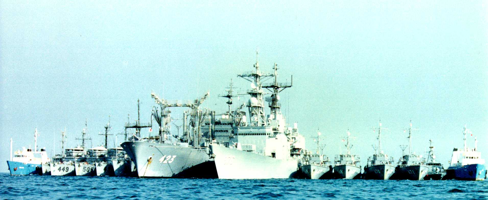

# Mine Counter Measures Group, mid-1991

[celina]: https://web.archive.org/web/20031226163655/http://www.gacworld.com/templates/gac_Template.aspx?id=32438
[vivi]: https://web.archive.org/web/20031226163655/http://www.gacworld.com/templates/gac_Template.aspx?id=32438
[hatsushima]: https://web.archive.org/web/20090905191350/http://www.globalsecurity.org/military/world/japan/hatsushima-pics.htm
[addriyah]: http://www.navsource.org/archives/11/05322.htm
[adjutant]: https://en.wikipedia.org/wiki/Adjutant-class_minesweeper
[jalboot]: https://web.archive.org/web/20161004192438/http://www.worldnavalships.com/kuwait_navy.htm
[hayase]: https://web.archive.org/web/20160313094225/http://www.globalsecurity.org/military/world/japan/hayase-mst.htm

 <em>Click to see full-size</em>

_MERRILL_ joined the Mine Counter Measures Group after the DESERT
STORM ceasefire.  After the clearance of the last Mine Danger Area in
the North Arabian Gulf, the Mine Counter Measures Group held a
celebratory &ldquo;raft-up.&rdquo; The Japanese oiler _TOKIWA_
anchored in the middle of the Gulf (which is actually pretty shallow)
and the other ships tied up to her.  A U.S. frigate [remained
underway](banzai-caption.html) in case of trouble.

The ships are, from left to right (to the best of my ability to
reconstruct things):

* M/V [_CELINA_][celina] (civilian diving support vessel)
* Saudi patrol boat ([_Addriyah_][addriyah]-class patrol minesweeper, ex-US [MSC 294][adjutant] type)
* USS [_IMPERVIOUS_](https://en.wikipedia.org/wiki/USS_Impervious_(MSO-449)) (MSO 449) (minesweeper)
* USS [_ADROIT_](https://en.wikipedia.org/wiki/USS_Adroit_(MSO-509)) (MSO 509) (minesweeper)
* USS [_LEADER_](https://en.wikipedia.org/wiki/USS_Leader_(MSO-490)) (MSO 490) (minesweeper)
* USS [_GUARDIAN_](https://en.wikipedia.org/wiki/USS_Guardian_(MCM-5)) (MCM 5) (minesweeper)
* JDS [_HAYASE_][hayase] (MST 462) (minesweeper tender)
* JDS [_TOKIWA_](https://en.wikipedia.org/wiki/Towada-class_replenishment_ship) (AOE 423) (fleet oiler)
* USS [_MERRILL_](https://en.wikipedia.org/wiki/USS_Merrill_(DD-976)) (DD 976) (destroyer)
* JDS [_HIKOSHIMA_][hatsushima] (MSC 669) (minesweeper)
* JDS [_YURISHIMA_][hatsushima] (MSC 668) (minesweeper)
* JDS [_AWASHIMA_][hatsushima] (MSC 670) (minesweeper)
* JDS [_SAKUSHIMA_][hatsushima] (MSC 671) (minesweeper)
* Kuwaiti missile boat (Lurssen TNC-45 type, presumably P4505
  [_JALBOOT_][jalboot] as that was the only TNC-45 to survive the
  invasion)
* M/V [_VIVI_][vivi] (civilian diving support vessel)

The U.S. MSOs, like the _MERRILL_, have been decommissioned.

**Many thanks to Mark Hosea at FTSCLANT for correcting the identity of the
MCM, and to CAPT Arthur Stauff for pointing out _HAYASE_.**

[[back]](navy.html)
